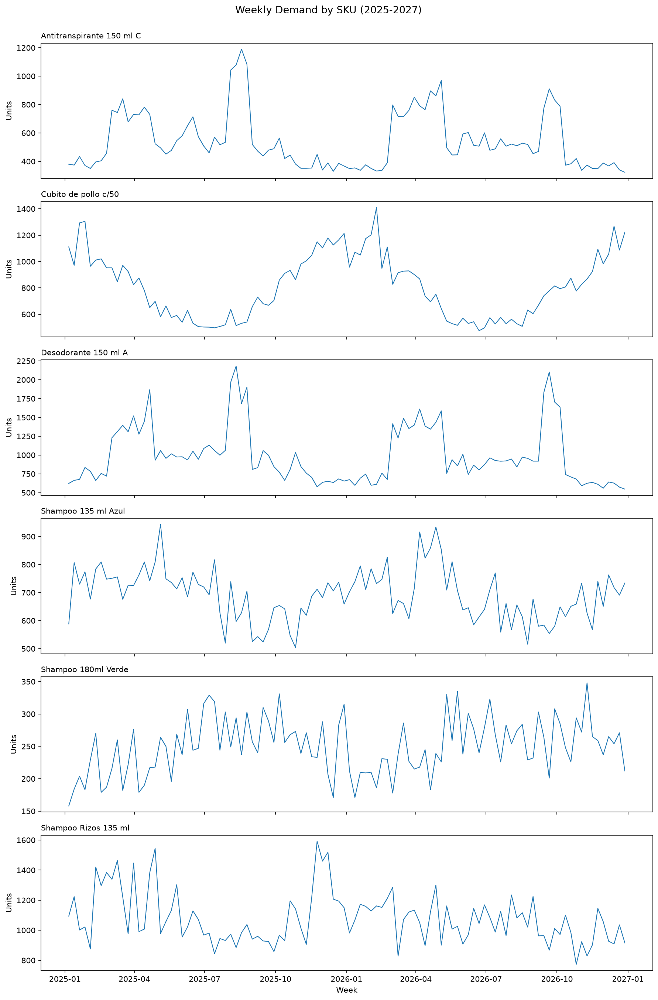
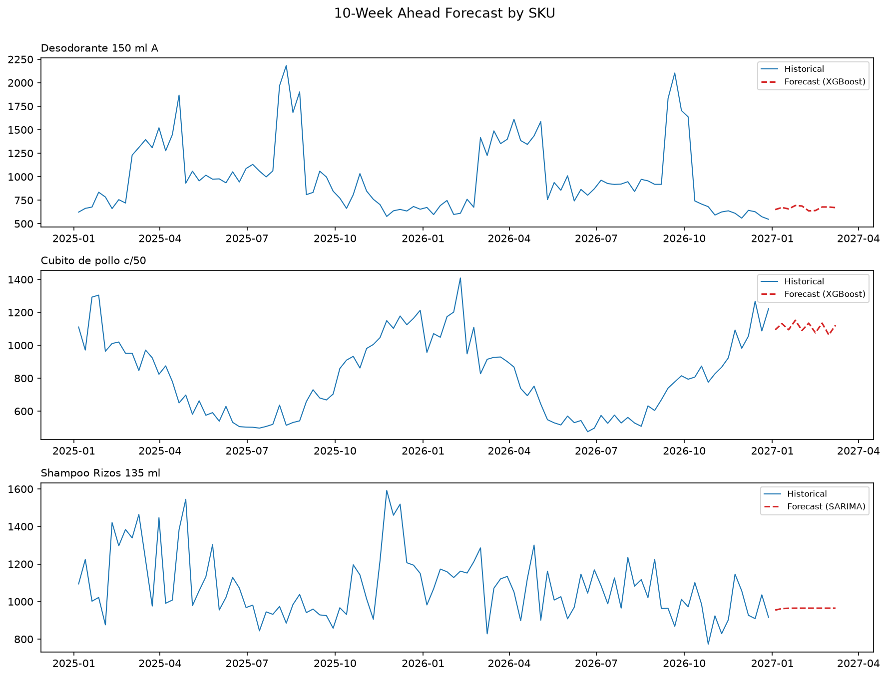
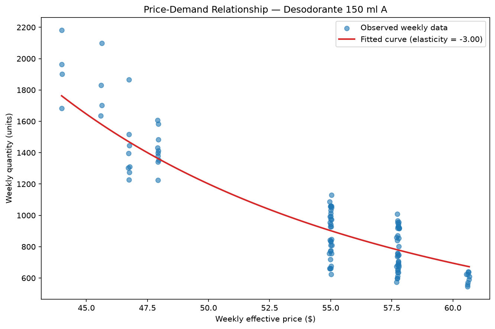
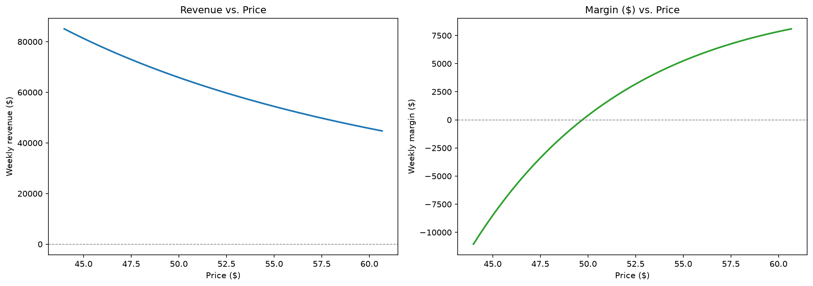

# VEMIO Technical Case — Findings

## 1. Data Cleaning: Assumptions and Rules

**Dataset:** 283,533 transactions, 6 SKUs, 12 warehouses, ~25 months (Jan 2025 - Jan 2027).

### Cancelled tickets (sell_in_quantity = 0, 500 rows)
Kept in the dataset with an `is_cancelled` flag rather than dropped, to preserve
traceability. Excluded from any demand aggregation, since they represent no
actual unit movement.

### Gift/sample transactions (sell_in_amount = 0, sell_in_quantity > 0, 500 rows)
Kept with an `is_gift` flag. Included in demand forecasting (Challenge A), since
these are real units that left inventory. Excluded from price/elasticity analysis
(Challenge B), since unit_price = 0 does not reflect a real market price and would
distort the regression.

### Missing product metadata (1 row)
Category, subcategory, brand, and basket were null for one row. Validated that
these fields are constant per `product_code` across the dataset, so the missing
values were filled by mapping from other rows of the same SKU — no row dropped.

### Missing discount / bruto (~5.5%)
`discount`, `bruto`, and `sell_in_amount` are algebraically related:
`bruto = sell_in_amount / (1 - discount)`. Most nulls were resolved by deriving
one column from the other two. For rows with no promotion (`id_combo` null),
missing values were treated as an organic sale (`discount = 0`).

For 3 residual rows that belonged to a promotion but had both `discount` and
`bruto` missing, `discount` was imputed using the average discount of that same
`id_combo` (from other transactions in the same promotion), then `bruto` was
derived from it.

One row remains null in `bruto`: it is a gift/sample transaction
(`sell_in_amount = 0`, `discount = 1.0`), where `bruto = amount / (1-discount)`
is mathematically undefined (division by zero). Since gift rows are already
excluded from price/elasticity analysis, this was left null rather than forcing
an arbitrary value.

### Missing product_cost (~0.04%, 110 rows)
Initially assumed unit cost (`product_cost / sell_in_quantity`) would be
constant per SKU, like `product_margin`. Validation showed this is false:
unit cost is a **step function over time** — it stays fixed for months, then
jumps to a new level (consistent with periodic supplier cost updates).

Missing values were imputed using the median unit cost of that same
`product_code` **within the same year-month**, not a global median, to avoid
mixing an old cost period with a new one. A `product_cost_imputed` flag was
added for traceability.

### Cleaning summary
All nulls resolved except one `bruto` value (gift transaction, left null by
design — see above). Zero rows dropped from the original 283,533.

## 2. Exploratory Analysis



Weekly demand was plotted for all 6 SKUs over the full 104-week history
(`../outputs/weekly_demand_by_sku.png`). Key observations:

- **Promotional spikes are clearly visible** and align with the combo date
  ranges in the data (e.g. Antitranspirante's largest spike, ~Aug-Sep 2025,
  matches "Combo Quincena"; Desodorante's largest spike, ~Mar-May 2026,
  matches "Combo Verano Desodorante 2"). This confirms promotions are driving
  real, measurable demand shifts — not just noise.
- **Desodorante / Antitranspirante** show strong, clear annual seasonality
  (demand rises each summer, Mar-May and Aug), consistent with a personal-care
  category tied to warm weather.
- **Cubito de pollo** shows a different pattern: seasonality *combined with* an
  upward trend (each yearly cycle ends at a higher level than the previous
  one) — a useful test of whether a model can separate trend from seasonality.
- **Shampoo SKUs (Azul, Verde, Rizos)** are noisier, with weaker seasonal
  signal — expected to be harder to forecast accurately.

## 3. Challenge A: Demand Forecasting

**SKU selection:** Desodorante 150 ml A, Cubito de pollo c/50, and Shampoo
Rizos 135 ml were chosen (out of the 6 available) to represent contrasting
demand patterns:
- *Desodorante 150 ml A* — strong, clear seasonality (the "easy" case).
- *Cubito de pollo c/50* — seasonality + trend combined, largest volume in
  the Alimentos category (a more complex case).
- *Shampoo Rizos 135 ml* — noisier demand, weaker seasonal signal (an honest
  "hard" case to show model limitations, rather than cherry-picking only
  well-behaved SKUs).

Shampoo 135 ml Azul and Shampoo 180ml Verde were excluded from this challenge
only to keep the analysis focused and readable — not because they lack value.
Shampoo 135 ml Azul and 180ml Verde also show the lowest price variation
(CV ~4.8-4.9%), making them weaker candidates for Challenge B regardless.

**Validation strategy:** the last 10 weeks of the 104-week history were held
out as a test set. All models are trained only on the prior 94 weeks and
evaluated on that unseen 10-week window — a walk-forward split, never random,
to avoid future information leakage.

**Baseline — Seasonal Naive:** predicts demand as equal to the same week, 52
weeks prior, respecting the annual seasonality observed in the EDA. This
baseline is the floor any more sophisticated model (SARIMA, XGBoost) must
beat to justify its added complexity.

**Baseline results:** WMAPE of 18.9% (Desodorante), 10.2% (Cubito de pollo),
and 31.7% (Shampoo Rizos). The error ranking matches the EDA: SKUs with
cleaner seasonal patterns forecast better with a naive approach, while
Desodorante's error is inflated by year-over-year shifts in promotional
timing that seasonal naive cannot capture.

**Models evaluated:**

1. **XGBoost (gradient boosting on tabular features)** — chosen first because
   it can directly incorporate a promo flag and lag features, which is
   exactly what seasonal naive is missing (see the Desodorante observation
   above). Features: lags (1, 2, 52 weeks), month, week-of-year, and
   promo-activity flag/discount depth for that week.
2. **SARIMA (Seasonal ARIMA)** — a classical statistical baseline that models
   the series purely from its own past values (trend + seasonality), without
   external regressors like promo activity. Included as a second comparison
   point to validate whether a simpler, more interpretable model performs
   competitively without promo information.

Both are compared against the Seasonal Naive baseline using the same
walk-forward 10-week holdout.

The weekly promo flag (`has_promo`) was validated against the known combo
date ranges — it correctly activates the same week each promotion starts,
with a visible demand jump (e.g. Antitranspirante: 457 → 760 units the week
"Combo Verano" began), confirming correct alignment between transaction-level
and weekly-aggregated data.

`lag_52` was excluded as a feature: with only 94 training weeks per SKU,
it would have discarded roughly half the training data (the entire first
year lacks a valid 52-week lag). `month` and `week_of_year` were used
instead to capture seasonality without that data loss.


## 4. Model Results & Comparison

**XGBoost results (Test 10 weeks):**

| SKU | MAPE | WMAPE | RMSE |
|---|---|---|---|
| Desodorante 150 ml A | 10.26% | 9.99% | 77.82 |
| Cubito de pollo c/50 | 6.49% | 6.68% | 86.76 |
| Shampoo Rizos 135 ml | 14.85% | 13.91% | 168.58 |

**SARIMA results (Test 10 weeks):**

| SKU | MAPE | WMAPE | RMSE |
|---|---|---|---|
| Desodorante 150 ml A | 59.87% | 58.78% | 371.59 |
| Cubito de pollo c/50 | 15.85% | 17.32% | 218.28 |
| Shampoo Rizos 135 ml | 12.68% | 11.98% | 128.76 |

SARIMA was fit without a seasonal component (`seasonal_order=(0,0,0,0)`):
with only 94 training weeks, there is not even two full annual cycles to
estimate a 52-week seasonal term reliably — the same reasoning used to
exclude `lag_52` from XGBoost's features.

**Model selection (best WMAPE per SKU):**

| SKU | Best model | WMAPE |
|---|---|---|
| Desodorante 150 ml A | XGBoost | 9.99% |
| Cubito de pollo c/50 | XGBoost | 6.68% |
| Shampoo Rizos 135 ml | SARIMA | 11.98% |

**Key finding — no single model wins across all SKUs:**

- **Desodorante** is the clearest case for promo-aware modeling. SARIMA
  (58.78% WMAPE) performs *worse than the naive baseline* — it extrapolates
  the tail of a recent promotion after it ends, since it has no visibility
  into promo activity. XGBoost, which uses `has_promo`/`avg_discount` as
  features, roughly halves the baseline's error.
- **Cubito de pollo** shows the same pattern: SARIMA (17.32%) underperforms
  both XGBoost (6.68%) and even the naive baseline (10.2%), because it was
  deliberately fit without seasonality — exactly the signal that drives this
  SKU (seasonality + trend, per the EDA).
- **Shampoo Rizos**, the noisiest series, is the one case where the simpler
  model wins: SARIMA (11.98%) slightly beats XGBoost (13.91%). With limited
  training data (92 weeks) and weak seasonal/promo structure, XGBoost has
  less signal to learn from and is more exposed to overfitting the lag
  features to noise.

**Conclusion:** model choice should be driven by what dominates each SKU's
demand pattern — promo timing and seasonality favor a feature-rich model
(XGBoost); noisy, weakly-structured series favor a simpler autoregressive
model (SARIMA). A per-SKU model selection outperforms committing to a single
model for the full catalog.

## 5. Final Forecast (8–12 Weeks Ahead)



The winning model per SKU was re-trained on the full history and used to
forecast 10 weeks ahead:

- **Cubito de pollo** (~1060–1150 units) is consistent with the trailing
  trend and considered reliable for planning purposes.
- **Desodorante** (~650–690 units, flat) likely **underestimates** actual
  demand for this window. This SKU has a strong Feb–Mar seasonal spike each
  year tied to "Combo Verano" promotions; since `has_promo`/`avg_discount`
  are held constant at their last observed (non-promo) value — the only
  information available about the future — the model has no way to
  anticipate a promotional jump. This forecast should be read as a
  **"no new promotion" baseline scenario**, to be adjusted upward manually
  if a promotion is planned, or re-run with `has_promo=1` and a realistic
  `avg_discount` for the relevant weeks.
- **Shampoo Rizos** (SARIMA) converges to a near-constant ~965 units after
  ~3 weeks, losing the volatility visible historically — an expected
  property of a non-seasonal ARIMA at this horizon, more reliable as a
  short-term (1–3 week) estimate than further out.

**Takeaway:** point forecasts alone are not sufficient for SKUs with known
future promotional activity (Desodorante) or high noise (Shampoo Rizos) —
both should be flagged for manual review / scenario adjustment rather than
used as-is for inventory planning.

## 6. Challenge B: Price Elasticity — Desodorante 150 ml A

### 6.1 SKU Selection

The case requires one SKU with sufficient historical price/discount
variation. Effective price (`sell_in_amount / sell_in_quantity`, excluding
gift and cancelled transactions) was compared across all 6 SKUs by
coefficient of variation:

| SKU | Mean price | Std | CV (%) | Transactions |
|---|---|---|---|---|
| **Desodorante 150 ml A** | **52.67** | **5.32** | **10.10** | **64,325** |
| Antitranspirante 150 ml C | 55.98 | 5.58 | 9.98 | 35,113 |
| Cubito de pollo c/50 | 197.76 | 14.10 | 7.13 | 52,508 |
| Shampoo Rizos 135 ml | 19.42 | 1.17 | 6.00 | 69,840 |
| Shampoo 135 ml Azul | 19.05 | 0.93 | 4.89 | 44,608 |
| Shampoo 180ml Verde | 16.16 | 0.77 | 4.79 | 16,139 |

**Selected: Desodorante 150 ml A** — highest price CV, second-highest
transaction volume (only Antitranspirante has a comparable CV, with roughly
half the sample size), and prior evidence from Challenge A of demand
clearly responding to its promotions.

### 6.2 Elasticity Model

**Model:** log-log regression of quantity on price, controlling for
calendar month:

```
log(quantity) = β₀ + β₁ · log(price) + β₂ · month_dummies
```

β₁ is directly interpretable as price elasticity. Month is controlled for
because Desodorante has strong seasonality (Challenge A) that moves together
with price (promotions run during high season), which would otherwise
inflate the elasticity estimate. Promo activity (`has_promo`) is *not*
controlled for separately, since it's mechanically redundant with price
(lower price *is* the promo) and would introduce collinearity.

**Result:** estimated elasticity of **-2.998** (p < 0.001, t = -19.05,
R² = 0.932) — demand is elastic: a 1% price increase is associated with a
~3% drop in weekly volume. Month effects confirm the seasonality from
Challenge A (May-September significantly higher than January).



Observed prices cluster around ~6 discrete levels ($44–$60.67) rather than
varying continuously, consistent with a small number of fixed discount
tiers. The fitted curve interpolates between these clusters.

### 6.3 Price Simulator

A simulator combines the fitted elasticity model with the most recently
observed unit cost (~$49.70) to project, for any price within the observed
range **($43.99–$60.67)**: expected demand, revenue, and margin ($ and %).



**Finding:** at the lower end of the range (~$44-47), simulated margin is
**negative** (-13% to -6%). This is not a modeling error — those price
levels historically occurred when unit cost was lower (~$45 in early 2025);
evaluated against today's cost (~$49.70), they would be unprofitable.

### 6.4 Recommended Price Zone

No interior optimum exists in this range: revenue is maximized at the
lowest observed price ($43.99, ~1,934 units/week) and margin ($) at the
highest ($60.67, ~738 units/week) — both range boundaries, not a "sweet
spot" in between. This follows directly from elastic demand: revenue falls
and margin rises monotonically with price throughout the observed range.

**Recommendation: price in the $55–$60 zone**, not a single point:

- Margin stays solidly positive (~14–18%), clear of the ~$50 break-even.
- Overlaps with prices already charged historically — customer acceptance
  at this level is evidenced by real data, not extrapolated.
- Avoids the ~62% volume collapse seen at the top of the range.

**No extrapolation:** all estimates and the recommended zone stay strictly
within the observed range ($43.99–$60.67); no projection is made outside it.

### 6.5 Risks & Assumptions

1. **Sell-in, not consumer demand.** Elasticity is estimated from
   distributor sell-in, not end-consumer sales. Forward buying around
   promotions likely inflates the measured sensitivity — true consumer-level
   elasticity is probably lower in magnitude.
2. **Cost held fixed at today's level.** Unit cost has risen ~10% over the
   observed history (step changes from supplier updates); if it rises again,
   actual margins at any price would be lower than projected here.
3. **Sparse coverage within range.** Prices cluster around ~6 discrete
   levels; the fitted curve is more reliable near those levels than in the
   gaps between them.
4. **Limited controls.** Only calendar month is controlled for; other
   unobserved factors (competitor actions, macro conditions, distribution
   changes) could bias the estimate in either direction.
5. **SKU-specific.** This elasticity applies to Desodorante 150 ml A only
   and should not be assumed to generalize to other SKUs.

## 7. Challenge C: Promotional Uplift — Desodorante 150 ml A

### 7.1 Methodology

**Selected promotions:** Combo Verano Desodorante 2 (Mar–May 2026, 17.1%
avg discount, largest promo in the dataset) and Combo Cierre Trimestre
Desodorante (Sep–Oct 2026, 21.1% avg discount, the deepest discount of all
19 combos). Both are on the same SKU used in Challenges A and B, connecting
uplift findings directly to the elasticity and forecasting results already
established.

**Method:** before/after baseline. Baseline weekly demand is the average of
the 6 weeks immediately preceding each promotion (non-promotional, no
overlap with another Desodorante combo). Incremental units are actual units
sold during the promotion minus (baseline weekly average × promo duration
in weeks). A year-over-year baseline was not used because the same calendar
window in the prior year also carried a promotion for this SKU — that would
compare promo-to-promo, not isolate an incremental effect.

**Limitation:** this method assumes baseline demand would have stayed flat
absent the promotion — it doesn't capture trend or seasonality within the
promotion window itself, a bigger risk for the 69-day Verano 2 promotion
than the 27-day Cierre Trimestre.

### 7.2 Results

| Metric | Verano 2 | Cierre Trimestre |
|---|---|---|
| Discount depth | 17.1% | 21.1% |
| Duration | 10 weeks | 4 weeks |
| Uplift (units) | +7,436 (+109.3%) | +3,574 (+96.5%) |
| Uplift per point of discount | 6.39 | 4.57 |
| Margin/unit (normal) | $10.40 | $10.43 |
| Margin/unit (during promo) | $0.49 | **-$1.79** |
| Margin from incremental units | **+$3,678** | **-$6,384** |
| Margin lost on baseline units | -$67,446 | -$45,233 |
| **Net incremental margin** | **-$63,768** | **-$51,617** |

Both promotions generated large positive unit uplift, but both were
net-negative in margin once accounting for baseline units sold at a
discount they didn't need. The critical difference: Verano 2's incremental
units were still profitable; Cierre Trimestre's were not, even before
accounting for baseline cannibalization.

### 7.3 Recommendation

**Replicate (with adjustment): Combo Verano Desodorante 2.** Its
incremental demand is real and profitable (+$3,678 margin on uplift alone).
The fix is discount depth, not the promotion itself — a shallower discount
would still trigger meaningful uplift (elasticity ≈ -3.0, Challenge B)
while protecting margin on baseline volume.

**Do not replicate: Combo Cierre Trimestre Desodorante.** Even its
incremental units sold at a loss. At current unit cost, no volume of
incremental sales makes this discount depth (21.1%) profitable — this isn't
a calibration issue, it's a structural loss.

**Root cause:** unit cost has risen ~10% over the observed history
(Section 6.5), but discount depths do not appear to have been re-calibrated
against that rising cost. Reviewing discount tiers against *current* cost
before each promotion is likely the highest-leverage fix available to the
commercial team.